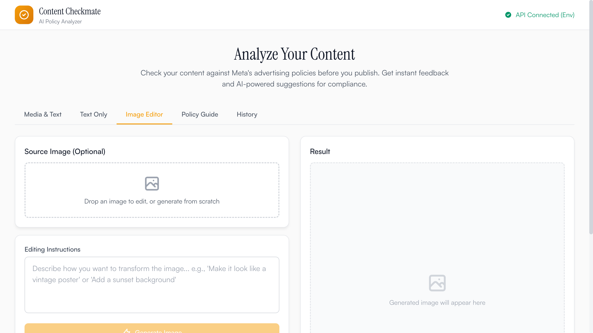

# Content Checkmate


AI-powered content policy analyzer for social media advertising compliance. Check your images and ad copy against platform policies before you publish.

**[Try it free at checkmycontent.com](https://checkmycontent.com)** — 5 free checks per day, no sign-up required.

## Demo

https://github.com/nerveband/content-checkmate/raw/main/promo-video/out/promo_with_audio.mp4

## Screenshots

| Policy Guide | Image Editor |
|:---:|:---:|
|  |  |

## Features

### Content Analysis
- **Image Analysis**: Upload images and get detailed policy compliance reports
- **Text Analysis**: Analyze descriptions, CTAs, and ad copy
- **Combined Analysis**: Analyze media with accompanying text
- **Bounding Box Overlays**: Visual highlighting of flagged content areas

### AI-Powered Features
- **Smart Fix Suggestions**: Get AI-generated editing instructions
- **Image Generation**: Create compliant alternative images (own-key mode)
- **Risk Scoring**: High/Medium/Low severity classifications
- **AI Detection**: Detect AI-generated imagery
- **Exclusion Rules**: Exclude legitimate content from flagging

### Two Usage Modes
- **Community Mode**: 5 free checks per day, no API key needed
- **Own-Key Mode**: Add your Gemini API key for unlimited checks, fix generation, and image editing

### Policy Guide
- Browse social media advertising policy documentation
- Search for specific policy areas
- Understand what content is allowed vs. restricted

## Tech Stack

- **Framework**: Svelte 5 with SvelteKit
- **Styling**: Tailwind CSS
- **AI Models**:
  - `gemini-3-flash-preview` - Content analysis
  - `gemini-3-pro-image-preview` - Image generation
- **Deployment**: Netlify (with server-side API proxy)
- **Build Tool**: Vite

## Getting Started

### Prerequisites

- Node.js 18+
- A Gemini API key from [Google AI Studio](https://aistudio.google.com/apikey)

### Installation

```bash
# Clone the repository
git clone https://github.com/nerveband/content-checkmate.git
cd content-checkmate

# Install dependencies
npm install

# Set up environment (for server-side proxy)
cp .env.example .env.local
# Edit .env.local and add your GEMINI_API_KEY

# Start development server
npm run dev
```

### Configuration

**Community mode** works out of the box with the server-side proxy. For **own-key mode**, users can enter their Gemini API key directly in the browser UI.

For the server-side proxy, set the `GEMINI_API_KEY` environment variable:

```env
GEMINI_API_KEY=your_gemini_api_key_here
```

## Usage

### Analyzing Content

1. **Upload Media**: Drag & drop or click to upload an image
2. **Add Context**: Enter description, CTA, and post intent
3. **Set Exclusions**: Select any content to exclude from flagging
4. **Analyze**: Click "Analyze Content" to get results

### Understanding Results

- **Compliant**: No issues found
- **Low Risk**: Minor issues, mostly compliant
- **Medium Risk**: Notable issues requiring attention
- **High Risk**: Serious violations requiring immediate action

### Image Editor

1. Upload a source image (optional)
2. Enter editing instructions in natural language
3. Generate AI-modified images
4. Download results

## Deployment

### Netlify (Recommended)

```bash
npm run build
```

Set `GEMINI_API_KEY` as an environment variable in your Netlify dashboard. The app uses `@sveltejs/adapter-netlify` and Netlify Blobs for rate limiting.

### Self-Hosting

Swap `adapter-netlify` for `adapter-node` in `svelte.config.js` for any Node.js hosting environment. Rate limiting will use an in-memory store.

## Development

```bash
# Development server with hot reload
npm run dev

# Type checking
npm run check

# Build for production
npm run build

# Preview production build
npm run preview
```

## Project Structure

```
src/
├── lib/
│   ├── components/
│   │   ├── ui/          # Base UI components
│   │   ├── layout/      # Header
│   │   ├── analysis/    # Analysis-related components
│   │   ├── editor/      # Image editor components
│   │   ├── history/     # Analysis history
│   │   └── guide/       # Policy guide components
│   ├── services/        # API integrations
│   ├── server/          # Server-side proxy & rate limiting
│   ├── shared/          # Shared logic (client & server)
│   ├── stores/          # Svelte 5 runes stores
│   ├── types/           # TypeScript types
│   ├── data/            # Policy data
│   └── utils/           # Utility functions
├── routes/
│   ├── api/             # Server API routes
│   ├── +layout.svelte   # App layout
│   └── +page.svelte     # Main page
└── app.css              # Global styles
```

## Contributing

1. Fork the repository
2. Create a feature branch
3. Make your changes
4. Submit a pull request

## License

MIT License - see LICENSE file for details.

---

Built by [Ashraf Ali](https://ashrafali.net) | [wavedepth](https://wavedepth.com)
